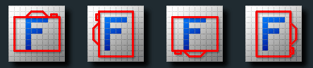
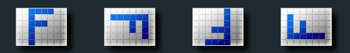

项目背景

* 调用手机拍照功能，竖拍上传照片后无法识别。

问题描述

* 手持设备不同方向所拍摄的照片方向不同，照片的方向都会不同，导致上传到后端的人脸识别服务不被识别。

问题解决

* 将图片数据转换成二进制数据，方便获取图片的exif信息；
* 通过图片exif信息，获取图片拍摄时所持设备方向orientation
* 判断拍照设备持有方向调整照片角度

Exif是什么

* Exif就是用来记录拍摄图像时的各种信息：图像信息（厂商，分辨率等），相机拍摄记录（ISO，白平衡，饱和度，锐度等），缩略图（缩略图宽度，高度等），gps（拍摄时的经度，纬度，高度）等，将这些信息按照JPEG文件标准放在图像文件头部。

什么是Exif.js

* Exif.js 提供了 JavaScript 读取图像的原始数据的功能扩展，例如：拍照方向、相机设备型号、拍摄时间、ISO 感光度、GPS 地理位置等数据。
* <https://github.com/exif-js/exif-js>

刨根问底

1. 假如对一个场景F进行拍摄

 

2. 相机它不理解拍摄的内容，因此照片都以相机的坐标系保存，于是上面四种情形实际拍摄出来的照片会像这样被存储

 

3. 方向传感器：为了克服这一情况，让照片可以真实的反应人们拍摄时看到的场景，现在很多相机中就加入了方向传感器，它能够记录下拍摄时相机的方向，并将这一信息保存在照片中。iphone 默认的照片方向并不是竖着拿手机时的情况，而是横向。

 

代码示例

```js
_processImg = function (previewDom, base64Img, orientation) {
    var MAX_HEIGHT, MAX_WIDTH, canvas, ctx, height, img, width;
    console.info("original base64Img size", base64Img.length / 1024 + ' KB');
    img = document.createElement('img');
    img.src = base64Img;
    canvas = document.getElementById("canvas-for-resize");
    ctx = canvas.getContext('2d');
    MAX_WIDTH = 800;
    MAX_HEIGHT = 800;
    width = img.width;
    height = img.height;
    if (width > height) {
        if (width > MAX_WIDTH) {
            height *= MAX_WIDTH / width;
            width = MAX_WIDTH;
        }
    } else {
        if (height > MAX_HEIGHT) {
            width *= MAX_HEIGHT / height;
            height = MAX_HEIGHT;
        }
    }
    canvas.width = width;
    canvas.height = height;
    if (orientation > 4) {
        canvas.width = height;
        canvas.height = width;
    }
    //图片做旋转操作
    switch (orientation) {
        case 3:
            ctx.translate(width, height);
            ctx.rotate(Math.PI);
            break;
        case 6:
            ctx.rotate(0.5 * Math.PI);
            ctx.translate(0, -height);
            break;
        case 8:
            ctx.rotate(-0.5 * Math.PI);
            ctx.translate(-width, 0);
    }
    ctx.drawImage(img, 0, 0, width, height);
    base64Img = canvas.toDataURL("image/jpeg", 0.9);
    base64Img = base64Img.substr(base64Img.indexOf('base64,') + 'base64,'.length);
    console.info("result base64Img size", base64Img.length / 1024 + ' KB');
    return base64Img;
};

readFile = function (e, previewDom, onReaderLoad) {
    var dirReader, file, files, orientation, reader;
    files = e.target.files;
    file = files[0];
    if (files && file) {
        if (!/\.(jpe?g|png|gif|bmp)$/i.test(file.name)) {
            return alert('您必须上传jpg, jepg, png, gif, bmp图片');
        }
        orientation = 1;
        dirReader = new FileReader();
        reader = new FileReader();
        dirReader.onloadend = function (e) {
            var exif;
            exif = EXIF.readFromBinaryFile(e.target.result);
            //获取到图片的Orientation
            orientation = exif.Orientation || 1;
            reader.onload = function (e) {
                var base64Img;
                base64Img = this.result;
                $(previewDom).one('load', function () {
                    return setTimeout(function () {
                        base64Img = _processImg(previewDom, base64Img, orientation);
                        return onReaderLoad(base64Img);
                    }, 100);
                });
                return $(previewDom).attr('src', base64Img);
            };
            return reader.readAsDataURL(file);
        };
        return dirReader.readAsArrayBuffer(file);
    }
};
```